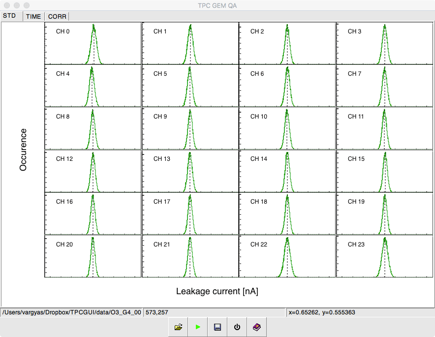
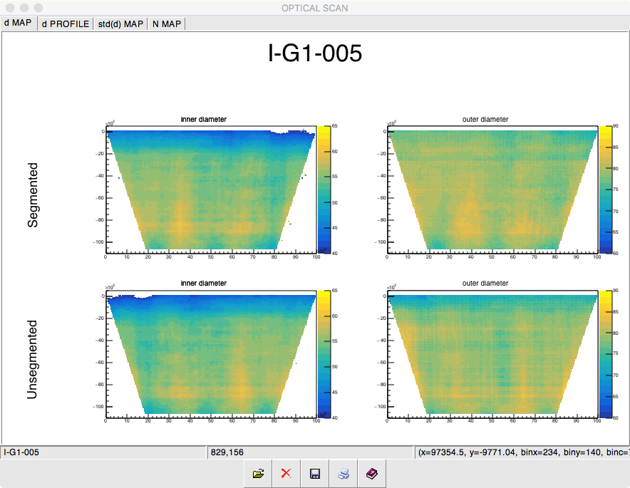

# TPCQA
## Software aid for the ALICE TPC Upgrade's advanced QA
### GUI for leakage current measurement, high-definition optical scan and gain scan

#### Leakage current
This part helps to plot and classify GEM foils with an interactive GUI. It processes almost all information from the leakage current measurement.

There are 5 buttons on the bottom: 
  * Load: after text file (in GSI data format) is selected, it plots 5 overview tabs with key variables. All of these are clickable, corresponding pad will pop up so one can edit it, e.g. zoom into it.
  * Evaulate: evaluates the foil (good/bad/questionable) and displays it with a color code on all plots (green/red/orange). Estimated saturation current is displayed.
  * Save: saves all plots into a single pdf file.
  * Exit: quits application, since closing the window might not work on all platforms
  * Help: should display doxygen documentation along with user manual. Not implemented yet

#### HD scan
This part converts and plots the output of the HD scan's neural network based postprocessor. First, it converts the hdf5 files into ROOT trees, with
all relevant information. Later, these smaller ROOT files can be loaded to display maps and profiles of the hole diameters.

There are 5 buttons on the bottom:
  * Load: by default it looks for a ROOT file. If there is none, one should select hdf5. Upon selection, it will process all files in a directory, create a ROOT file and load it.
  * Clear: clear loaded histograms
  * Save: saves 2D and 1D data into text files
  * Print: print all canvases into a single pdf file
  * Help: save as above

#### Gain scan
Not implemented yet.
