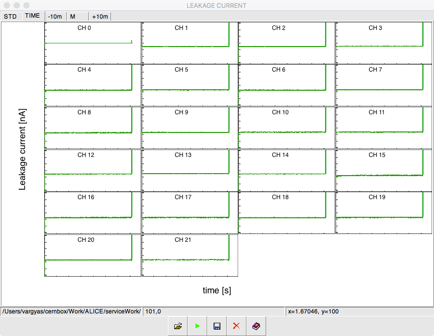

# TPCgui
## Software aid for the ALICE TPC Upgrade's leakage current measurement

This software helps to plot and classify GEM foils of the ALICE TPC Upgrade project with an interactive GUI. It processes information from the leakage current measurement.     

There are 5 buttons on the bottom: 
  * Load: after text file (in GSI data format) is selected, it plots 3 overview tabs with key variables. All of these are clickable, corresponding pad will pop up so one can edit it, e.g. zoom into it.
  * Evaulate: evaluates the foil (good/bad/questionable) and displays it with a color code on all plots (green/red/orange)
  * Save: saves all plots into a single pdf file. This can be uploaded to the database
  * Exit: quits application, since closing the window might not work on all platforms. 
  * Help: should display doxygen documentation along with user manual. Not implemented yet
